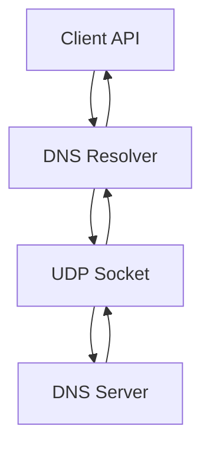

# システムパターン：DNS解決の実装アーキテクチャ

## アーキテクチャ概要

## 主要コンポーネント

### 1. DNSリゾルバ
- 責務：ドメイン名からIPアドレスへの解決処理
- パターン：Promise-based Async Processing
- エラーハンドリング：段階的なエラー分類

### 2. UDPソケット通信
- 責務：DNSサーバーとの通信
- パターン：Raw Socket Communication
- タイムアウト処理：Promise with timeout

### 3. DNSメッセージ処理
- 責務：DNSプロトコルメッセージの構築と解析
- パターン：Binary Protocol Parser
- フォーマット：RFC準拠のメッセージ構造

## 設計原則

### 1. エラー処理パターン
- 明確なエラー分類
- 具体的なエラーメッセージ
- エラーの階層構造化

### 2. 非同期処理パターン
- Promiseベースの実装
- タイムアウト処理の統合
- エラーチェーンの維持

### 3. バリデーションパターン
- 入力値の早期検証
- 型安全性の確保
- 段階的な検証プロセス

## コンポーネント間の関係

### データフロー
1. クライアントAPI
   - ドメイン名の受け取り
   - Promise形式でのレスポンス返却

2. DNSリゾルバ
   - クエリの構築
   - レスポンスの解析
   - IPアドレスの抽出

3. UDPソケット
   - DNSサーバーとの通信
   - タイムアウト管理
   - エラー伝播

## テスト戦略
- ユニットテスト：各コンポーネントの独立したテスト
- 統合テスト：コンポーネント間の連携確認
- エラーケース：各種エラー状況の検証